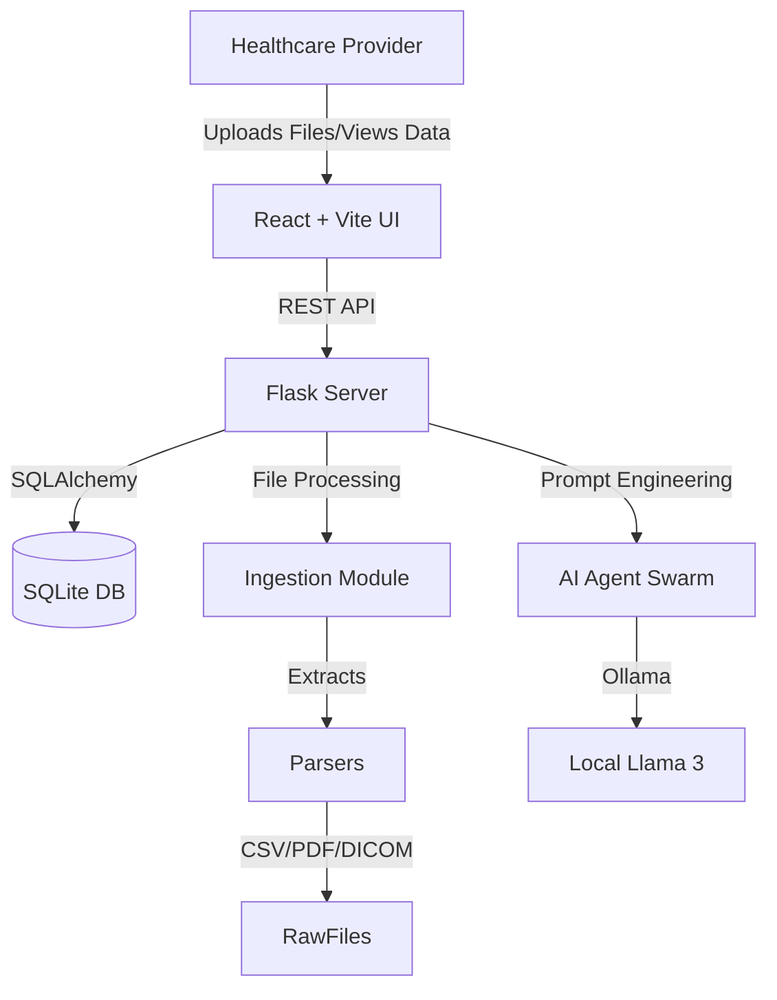

# Health Insight Hub

## 1. Executive Summary
**Health Insight Hub** is a full-stack web application designed to ingest multi-modal medical data (CSV, PDF, DICOM, VCF), store it in a centralized database, and provide AI-driven analysis for healthcare professionals. It features a modern React-based frontend and a robust Flask backend powered by local AI agents.

## 2. Architecture Diagram

## 3. Technology Stack

### Frontend
- **Framework**: React 18 (via Vite)
- **Language**: TypeScript
- **Styling**: Tailwind CSS + Shadcn UI (Radix Primitives)
- **State Management**: React Query
- **Routing**: React Router DOM
- **Key Features**:
    - Dashboard for patient list and health summary.
    - File upload interface.
    - Responsive, modern design with dark mode support.

### Backend
- **Framework**: Flask (Python)
- **Database**: SQLite (via Flask-SQLAlchemy)
- **AI Integration**: Ollama (Client-side implementation)
- **Data Parsing**:
    - `pypdf`: For doctor's notes extraction.
    - `pydicom`: For medical imaging metadata.
    - `csv`: For vital signs and lab results.
- **Testing**: `unittest` framework.

## 4. Key Components

### A. Data Ingestion (`backend/ingestion.py`)
Acts as the gateway for all file uploads. It routes files to specific parsers based on extension:
- **PDFs**: Uses layout-aware extraction to read doctor's notes. Includes quality checks to flag scanned documents.
- **CSVs**: Parses bulk data for vitals and lab results (e.g., Blood Pressure, Cholesterol).
- **DICOM**: Extracts metadata (Patient Name, Modality, Body Part) from medical images.
- **VCF**: Parses genomic variant files to identify potential risk factors.

### B. Database Schema (`backend/db.py`)
A relational schema designed for patient-centric care:
- **Patient**: Core entity.
- **MedicalRecord**: Longitudinal vitals data.
- **LabResult**: Discrete lab values with flags (High/Normal).
- **ImagingRecord**: Metadata for X-Rays/CTs/MRIs.
- **GenomicData**: Genetic variants and risk associations.
- **DoctorNote**: Textual clinical notes (SOAP format).
- **AIAnalysis**: Stores generated AI summaries.

### C. AI Agent Architecture (`backend/agents/`)
A multi-agent system orchestrates the analysis:
1.  **Vitals Agent**: Analyzes trends in blood pressure and heart rate.
2.  **Lab Agent**: Interprets lab results and flags anomalies.
3.  **Risk Agent**: Correlates demographics and genomics to predict future risks.
4.  **Scribe Agent**: Synthesizes inputs from all other agents into a final Executive Summary.

## 5. Recent Improvements
- **Doctor's Note Quality**: formatting issues fixed by implementing layout-aware PDF extraction and identifying bad scans.
- **Demo Data Realism**: `seed.py` was updated to generate realistic "SOAP" notes instead of random text, and now includes a consistent demo patient "Diana Bush" (Age 58).

## 6. How to Run
1.  **Backend**: `python run.py` (Runs on port 5000)
2.  **Frontend**: `npm run dev` (Runs on port 5173 or similar)
