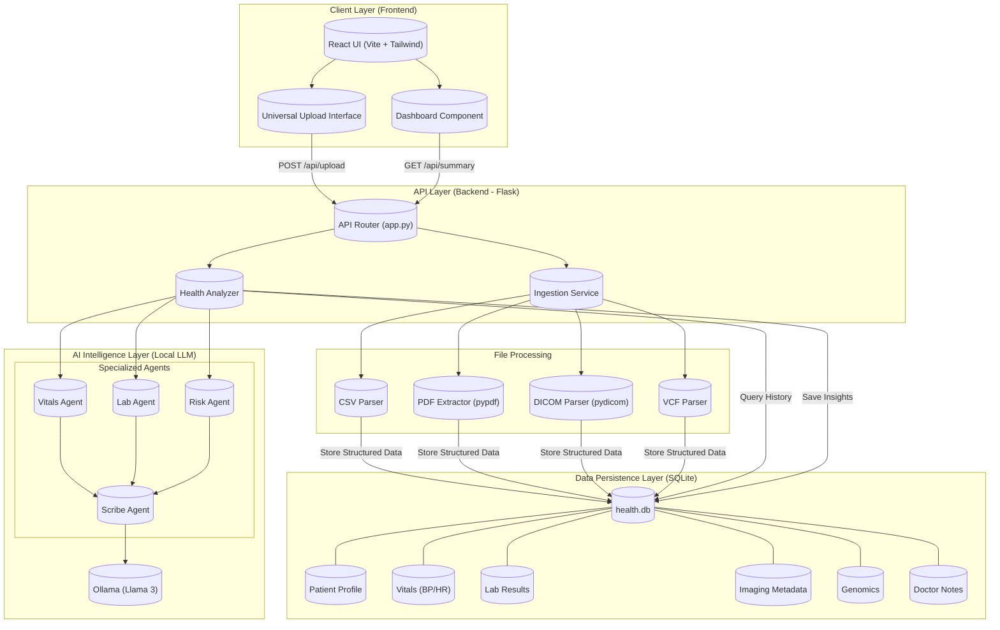

# Solution Architecture

## Component Description

### 1. Client Layer
- **React UI**: Modern SPAs handling user interaction.
- **Universal Upload**: Accepts CSV, PDF, DICOM, and VCF files.

### 2. API Layer
- **Flask Backend**: Orchestrates data flow.
- **Ingestion Service**: Routes files to specific parsers based on extension.
- **Health Analyzer**: Aggregates data for AI processing.

### 3. AI Intelligence Layer
- **Local Ollama**: Runs Llama 3 for privacy-first inference.
- **Multi-Agent System**:
    - **Vitals Agent**: Analyzes BP/Heart Rate trends.
    - **Lab Agent**: Interprets blood work.
    - **Risk Agent**: Correlates genomics with history.
    - **Scribe Agent**: Synthesizes all outputs into a final report.

### 4. Data Layer
- **SQLite**: Relational storage for all structured health data.
